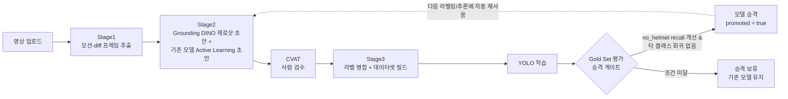
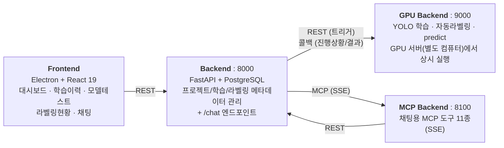
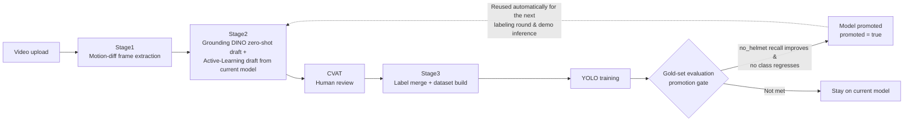
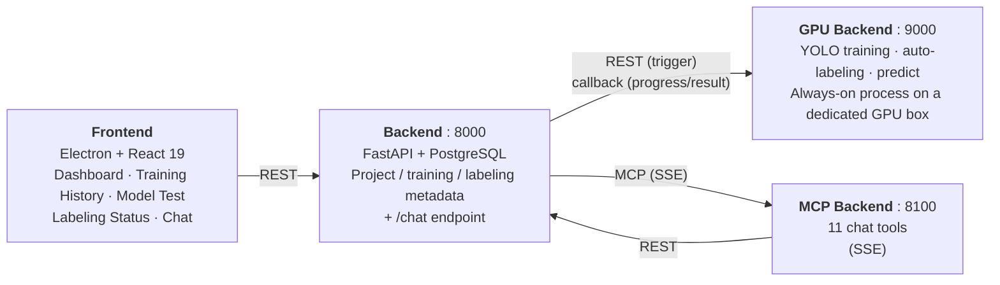

# 👁 Watchers

**산업현장 안전(EHS) 위험요소를 탐지하는 YOLO 모델을, 자동 라벨링부터 학습·검증·배포까지 스스로 개선시키는 MLOps 플랫폼.**
자연어 채팅만으로도 전체 파이프라인을 운영할 수 있습니다.

[🇰🇷 한국어](#한국어) ・ [🇺🇸 Read in English](#english)

---

<br>

# 한국어

## 이 프로젝트가 하는 일

CCTV/현장 영상에서 **지게차(forklift) · 작업자(person) · 안전모(helmet) · 안전모 미착용(no_helmet)** 을 탐지하는 YOLO 모델을 만들고, 아래 사이클을 통해 사람 개입을 최소화하면서 모델을 지속적으로 개선합니다.



새 영상만 계속 넣어주면, **모션 감지 → 자동 라벨 초안 → 사람 검수 → 학습 → 성능이 실제로 좋아졌을 때만 자동 승격**까지 전 과정이 파이프라인으로 돌아갑니다. 승격된 모델은 다음 라벨링(Active Learning 초안)과 데모 추론에 즉시 재사용됩니다.

## 왜 이 프로젝트가 다른 점

- **승격 게이트가 코드로 강제됨** — 사람이 검수한 라벨이 바뀌지 않으면 재학습 자체를 건너뛰고(gate), 안전에 가장 중요한 `no_helmet` 클래스의 recall이 실제로 개선되고 다른 클래스가 3%p 이상 나빠지지 않을 때만 모델을 승격합니다. 자동 라벨링 데이터가 검증/평가 기준셋을 절대 오염시키지 못하도록 디렉터리 단위로 물리적으로 격리합니다.
- **채팅으로 운영 가능** — OpenAI Responses API의 네이티브 MCP 연동으로 "라벨링 현황 어때?", "학습 새로 돌려줘" 같은 자연어 요청이 실제 학습/라벨링 파이프라인을 트리거하거나 DB 데이터를 조회합니다.
- **GPU 1대를 device 분리로 동시 활용** — 학습(`TRAIN_DEVICE`)과 라벨링/추론(`LABEL_DEVICE`)이 서로 다른 CUDA device를 사용해, 채팅에서 "학습도 돌리고 라벨링도 같이 해줘"라고 해도 서로 기다리지 않습니다.
- **YOLO 클래스 인덱스가 모델 가중치에 영구히 고정** — 프로젝트 생성 시 선택한 클래스 순서가 그대로 학습 라벨 인덱스가 되며, 기존 모델을 이어받아 새 프로젝트를 만들 때 클래스 순서가 정확히 일치하는지 API 레벨에서 검증합니다.

## 시스템 아키텍처

4개의 독립 프로세스가 REST/MCP로만 통신하며, 팀 서버 1대 + 물리적으로 분리된 GPU 서버 1대로 배포됩니다.



- **backend** — 통제 평면(control plane). 영상/가중치 같은 대용량 파일은 직접 저장하지 않고 GPU 서버로 릴레이하며, 프로젝트/클래스/학습이력/라벨링 진행상황 등 메타데이터만 PostgreSQL에 저장합니다.
- **gpu-backend** — 물리 GPU 서버에서 상시 실행. 학습(`/train`), 자동라벨링(`/autolabel/run`), 데모 추론(`/predict/run`)을 하나의 FastAPI 프로세스로 처리하며, backend와는 "트리거는 REST POST, 진행상황/결과는 콜백"으로 통신합니다.
- **mcp-backend** — DB에 직접 접근하지 않고 backend REST API만 호출하는 순수 어댑터. 채팅 LLM이 호출할 수 있는 tool 11개를 제공합니다.
- **frontend** — Electron 데스크톱 앱. 대시보드/학습이력/모델테스트/라벨링현황/채팅 5개 화면.

## 핵심 기능

| 기능 | 설명 |
|---|---|
| 자동 라벨링 파이프라인 | 모션-diff로 의미 있는 프레임만 추출 → Grounding DINO(제로샷) + 기존 모델(Active Learning) 이중 초안 생성 → CVAT 검수 결과 반영 → `검수 > 기존/AL 초안 > DINO 보충` 우선순위로 라벨 병합 |
| YOLO 학습 자동화 | 1차 학습은 pretrained 모델, 2차부터는 직전 승격 모델을 자동으로 이어받아 학습. epoch별 진행상황을 실시간 보고 |
| Gold Set 승격 게이트 | 고정된 평가셋으로 신/구 모델을 비교해, 안전 최우선 클래스 recall이 개선되고 다른 클래스가 유의미하게 나빠지지 않을 때만 자동 승격 |
| 버전별 모델 관리 | 학습 완료마다 `best_v1.pt`, `best_v2.pt`… 자동 버저닝, 대시보드/채팅에서 원하는 버전 선택·다운로드 |
| 데모/시각화 추론 (predict) | 채팅으로 "이 영상 라벨링 해줘"라고 하면 현재 승격 모델로 즉시 박스 시각화 영상 생성 (학습 데이터셋에는 영향 없음) |
| 채팅 기반 운영 | OpenAI Responses API + MCP로 라벨링/학습 현황 조회, 학습·라벨링 시작, 모델 다운로드 링크 안내까지 자연어로 처리 |
| 프로젝트별 완전 격리 + 모델 계보 상속 | 데이터셋 경로/검출 클래스/학습 결과가 프로젝트 단위로 분리, 기존 모델을 이어받아 새 프로젝트를 만들면 학습 이력 전체(가중치+epoch 곡선)를 복제 |
| CVAT 휴먼 검수 루프 | 자동 라벨 → 검수용 zip 다운로드 → CVAT에서 사람이 검수 → 재업로드 → 데이터셋 자동 갱신까지 UI로 완결 |

## 팀 구성 · 역할

AI 부트캠프 팀 프로젝트 (2026-07, 4명, 3개 트랙으로 진행)

| Track | 담당 | 역할 |
|---|---|---|
| **데이터 · 모델** | 황영중, 홍현경 | CVAT 수동 라벨링·검수, 자동 라벨링(DINO/Motion) 구현, YOLO 학습·성능 실험, 오버샘플링·트래킹 실험, 시연 영상·PPT 초안 |
| **백엔드 · MCP · 총괄** (발표자) | 김다희 | FastAPI 백엔드 설계·구현, GPU 서버 연동, MCP 서버·도구 11종 구현, Docker 컨테이너 환경 구성, 프론트–백엔드 API 흐름 설계, 최종 발표·대본 작성 |
| **프론트엔드** | 김민혁 | Electron 데스크톱 앱, 대시보드 UI, 채팅 UI·이력 뷰, API 연동·상태 관리, UX 흐름 최종 정리 |

## 기술 스택

| 영역 | 스택 |
|---|---|
| Backend | FastAPI, SQLAlchemy 2.0, PostgreSQL, Alembic, Pydantic v2, httpx, OpenAI SDK (Responses API) |
| ML / 자동 라벨링 | Ultralytics YOLO, Grounding DINO (HuggingFace Transformers), OpenCV, pandas, ffmpeg |
| 채팅 도구 서버 | FastMCP (SSE transport) |
| Frontend | Electron, React 19, TypeScript, React Router 7, Zustand, Tailwind CSS v4, Radix UI / shadcn, Recharts |
| 인프라 | Docker Compose (backend + mcp + PostgreSQL + pgAdmin), GPU 서버는 bare-metal 별도 운영 |

## 레포지토리 구성

| 레포 | 설명 |
|---|---|
| [`backend`](https://github.com/The-Watcherss/backend) | 컨트롤 플레인 API. 프로젝트/클래스/영상/학습/자동라벨링/predict 관리 + `/chat` (OpenAI × MCP) |
| [`gpu-backend`](https://github.com/The-Watcherss/gpu-backend) | GPU 서버에서 상시 실행되는 학습 + 자동라벨링(Grounding DINO/Active Learning) + predict 통합 서버 |
| [`gpu-backend-labeling`](https://github.com/The-Watcherss/gpu-backend-labeling) | gpu-backend의 라벨링·학습 전용 변형본(predict 파이프라인 제외), 별도 배포용 |
| [`mcp-backend`](https://github.com/The-Watcherss/mcp-backend) | 채팅에서 backend REST API를 도구로 쓸 수 있게 감싸는 FastMCP(SSE) 서버, tool 11종 |
| [`frontend`](https://github.com/The-Watcherss/frontend) | Electron + React 19 데스크톱 앱 |

각 레포 안에 폴더별 상세 README가 별도로 있습니다. 팀 서버 공유 Docker 환경 세팅은 `backend`/`DOCKER.md`를 참고하세요.

## 빠르게 띄워보기 (로컬)

```bash
# 1) PostgreSQL 준비
createdb watchers_db

# 2) 백엔드
cd backend
cp .env.example .env         # DATABASE_URL, GPU_SERVER_URL, MCP_SERVER_URL, OPENAI_API_KEY 등 채우기
pip install -r requirements.txt
alembic upgrade head          # 스키마 생성 + 클래스 마스터(4종) 초기 데이터 등록
uvicorn main:app --host 0.0.0.0 --port 8000 --reload

# 3) GPU 서버 (학습 + 자동라벨링 + predict, GPU 있는 컴퓨터에서)
cd gpu-backend
cp .env.example .env
pip install -r requirements.txt
uvicorn main:app --host 0.0.0.0 --port 9000

# 4) MCP 서버 (채팅 도구)
cd mcp-backend
cp .env.example .env
python mcp_server.py

# 5) 프론트엔드
cd frontend
npm install
npm run dev
```

Docker로 팀 서버 전체(`db` + `backend` + `mcp` + `pgadmin`)를 한 번에 띄우는 방법은 `backend`의 `DOCKER.md`를 참고하세요. GPU 서버는 물리적으로 별도 컴퓨터라 Docker화하지 않고 bare-metal로 상시 실행하며, backend와 파일시스템을 공유합니다(NFS 등).

<details>
<summary><b>📖 기술 상세 — API/스키마/파이프라인/MCP 도구 펼치기</b></summary>

### 데이터베이스 스키마 (9개 테이블)

| 테이블 | 역할 |
|---|---|
| `classes` | 클래스 마스터 (forklift/person/helmet/no_helmet) |
| `projects` | 프로젝트 마스터, `dataset_path`는 서버가 고정 생성 |
| `project_classes` | 프로젝트-클래스 N:M + **`class_index`**(YOLO 라벨 인덱스 고정) |
| `autolabel_videos` | 라벨링 대상 영상, 진행상황(fps/해상도/처리 프레임 수) |
| `autolabel_runs` / `autolabel_run_videos` | 자동라벨링 파이프라인 1회 실행의 stage1~3 산출물 전부 + 대상 영상 N:M |
| `training_runs` | 학습 1회 = 1 row. 최종 지표, 가중치 경로, `promoted`(프로젝트당 최대 1개) |
| `training_epochs` | epoch별 loss/precision/recall/mAP (results.csv 미러링) |
| `predict_runs` | 채팅 "라벨링 해줘"로 트리거되는 1회성 추론(시각화) 기록 |

### 핵심 API (backend, 총 35개 엔드포인트 중 발췌)

| 엔드포인트 | 설명 |
|---|---|
| `POST /projects` | 프로젝트 생성. 클래스 선택 순서 = `class_index`, `source_model_run_id`로 기존 모델의 학습 이력 전체 복제 가능 |
| `POST /autolabel/videos/upload` → `POST /autolabel/start` | 영상 업로드(GPU 서버로 릴레이) → 자동라벨링 트리거 |
| `POST /autolabel/runs/{id}/reviewed-dataset` | CVAT 검수 zip 업로드 → 데이터셋 자동 갱신 |
| `POST /training/run` | 학습 시작. `base_weights` 미지정 시 승격 모델 → 없으면 1차 학습으로 자동 판단 |
| `GET /projects/{id}/models`, `GET /models/{run_id}/pt` | 버전별 모델 다운로드 |
| `POST /predict/run` | 데모/시각화 전용 추론 트리거 (학습 데이터셋과 무관) |
| `POST /chat` | OpenAI Responses API를 MCP 서버(`type: "mcp"`)와 연결해 자연어 요청 처리 |

GPU 서버는 학습/라벨링/predict 진행상황과 결과를 `PATCH .../progress`, `POST .../report` 콜백으로 backend에 보고합니다.

### 채팅 MCP 도구 11종 (`mcp-backend/mcp_server.py`)

| tool | 트리거 예시 | 호출 API |
|---|---|---|
| `get_labeling_kpi` | "라벨링 현황 어때?" | `GET /labeling/kpi` |
| `get_training_history` / `get_training_detail` | "학습 이력 보여줘" / "N번 학습 상세히" | `GET /training/history`, `GET /training/{id}` |
| `start_training` | "학습 새로 돌려줘" | `POST /training/run` |
| `start_autolabel` | "라벨링 시작해줘" | `GET /autolabel/videos` → `POST /autolabel/start` |
| `get_model_download_info` | "N차 모델 다운받고 싶어" | `GET /projects/{id}/models` |
| `predict_video` / `get_predict_result` | "이 영상 라벨링 해줘" / "다 됐어?" | `POST /predict/run`, `GET /predict/runs/{id}` |
| `list_projects` / `get_project_classes` / `list_project_videos` | 보조 조회(이름→ID 리졸버) | `GET /projects`, `/projects/{id}/classes`, `/autolabel/videos` |

### 자동 라벨링 5단계 파이프라인 (`gpu-backend`)

1. **Stage1** — 프레임 후보(기본 600프레임 간격)마다 모션 diff(그레이스케일+블러+절대차분+임계값)로 변화 픽셀 비율 0.3% 이상일 때만 저장. 30프레임 연속 스킵 시 강제 저장.
2. **Stage2** — 아직 초안이 없는 이미지만 대상으로 Grounding DINO(제로샷, box threshold 0.35) 초안과 현재 승격 모델의 Active Learning 초안(conf 0.25/iou 0.50)을 함께 생성.
3. **Stage2.5** — CVAT 검수 완료 zip이 들어와 있으면 클래스명 기준 remap 후 흡수.
4. **Stage3** — `검수 > 기존(legacy)/Active Learning > DINO(IoU 0.50 미만 중복 아닌 것만 보충)` 우선순위로 라벨 병합, `train`/`val`(`fixed_val` 고정) 데이터셋 생성, 아직 검수 안 된 이미지만 CVAT 검수용으로 재추출.
5. **Gold Set 평가 & 승격(stage5)** — 고정 평가셋으로 신/구 모델 비교, `no_helmet` recall이 개선되고 다른 클래스가 3%p 이상 나빠지지 않을 때만 `promoted=true`. `fixed_val`/`gold_set`은 파이프라인이 절대 자동으로 채우지 않고 별도 도구로 사람이 관리하며, 학습 pool과 물리적으로 격리되어 있는지 매 실행마다 검증합니다.

학습과 라벨링/추론은 GPU 1대를 `TRAIN_DEVICE` / `LABEL_DEVICE`로 논리 분리해 동시 실행되며, `run_all.py` CLI로 backend 없이도 cron 기반 자율 실행이 가능합니다.

</details>

---

<br>

# English

## What This Is

Watchers is an **MLOps platform for industrial safety (EHS) object detection**. It trains and continuously improves a YOLO model that detects **forklifts, workers, hard hats, and missing-hard-hat violations** in on-site video footage — and the whole cycle can be operated through natural-language chat, not just a dashboard.



Keep feeding in new footage, and the pipeline handles everything: **motion detection → auto-draft labels → human review → training → automatic promotion, but only when performance genuinely improves.** The promoted model is immediately reused as the Active-Learning draft source for the next labeling round and for demo inference.

## What Makes It Different

- **The promotion gate is enforced in code, not policy.** Retraining is skipped entirely if reviewed labels haven't changed (a fingerprint gate), and a new model is only promoted if recall on the safety-critical `no_helmet` class actually improves *and* no other class regresses by more than 3 points. The auto-labeled training pool is physically isolated from the fixed validation/gold-set directories, checked on every run.
- **Fully chat-operable.** Using OpenAI's native Responses-API MCP integration, requests like "라벨링 현황 어때?" ("how's labeling going?") or "학습 새로 돌려줘" ("kick off a new training run") directly trigger the real pipeline or query live DB data.
- **One GPU, two independent workloads.** Training (`TRAIN_DEVICE`) and labeling/inference (`LABEL_DEVICE`) run on separate CUDA device indices on the same physical box, so asking the chat to "train and label at the same time" actually runs both concurrently instead of queuing.
- **YOLO class order is locked at the API layer.** The class selection order at project-creation time becomes the permanent label index baked into the trained weights; forking a new project from an existing model requires the class order to match exactly, enforced server-side.

## Architecture

Four independent processes communicating only over REST/MCP, deployed across one team server plus one physically separate GPU machine.



- **backend** — the control plane. Never stores large media itself (videos/weights are relayed to or fetched from the GPU server); persists only metadata (projects, classes, training history, labeling progress) in PostgreSQL.
- **gpu-backend** — runs continuously on the GPU machine. Handles training (`/train`), auto-labeling (`/autolabel/run`), and demo inference (`/predict/run`) in a single FastAPI process, communicating with the backend via "REST to trigger, callback to report progress/results."
- **mcp-backend** — a pure adapter with no direct DB access; exposes 11 chat-callable tools that wrap the backend's REST API.
- **frontend** — an Electron desktop app with 5 screens: Dashboard, Training History, Model Test, Labeling Status, Chat.

## Key Features

| Feature | Description |
|---|---|
| Auto-labeling pipeline | Motion-diff extracts only meaningful frames → dual draft generation via Grounding DINO (zero-shot) and the current promoted model (Active Learning) → CVAT review absorbed → labels merged by priority: `reviewed > legacy/Active-Learning draft > DINO (gap-fill only)` |
| Automated YOLO training | First run starts from a pretrained checkpoint; every subsequent run automatically continues from the last promoted model. Per-epoch progress is reported live |
| Gold-set promotion gate | New vs. current model compared against a fixed evaluation set; promoted only if recall improves on the safety-critical class with no meaningful regression elsewhere |
| Versioned model management | Every completed training run is auto-versioned (`best_v1.pt`, `best_v2.pt`, …), downloadable from the dashboard or via chat |
| Demo / visualization inference (predict) | "Run detection on this video" in chat instantly produces an annotated video with the currently promoted model — never touches the training dataset |
| Chat-based operations | OpenAI Responses API + MCP handle status queries, starting training/labeling jobs, and surfacing model download links, all in natural language |
| Per-project isolation + model lineage | Dataset paths, detected classes, and training artifacts are fully isolated per project; forking a new project from an existing model clones its entire training history (weights + epoch curves) |
| CVAT human-in-the-loop review | Auto-labeled data → download a review package → human correction in CVAT → re-upload → dataset regenerated automatically, all through the UI |

## Team & Roles

AI Bootcamp team project (July 2026, 4 members across 3 tracks)

| Track | Members | Responsibilities |
|---|---|---|
| **Data & Modeling** | Hwang Young-jung, Hong Hyun-kyung | Manual CVAT labeling & review, building the auto-labeling pipeline (DINO / motion-diff), YOLO training & performance experiments, oversampling/tracking experiments, demo video & slide draft |
| **Backend, MCP & Lead** (Presenter) | Kim Da-hee | Designed and built the FastAPI backend, GPU server integration, the MCP server and its 11 tools, Docker containerization, frontend–backend API design, final presentation |
| **Frontend** | Kim Min-hyeok | Electron desktop app, dashboard UI, chat UI & history views, API integration & state management, final UX flow |

## Tech Stack

| Area | Stack |
|---|---|
| Backend | FastAPI, SQLAlchemy 2.0, PostgreSQL, Alembic, Pydantic v2, httpx, OpenAI SDK (Responses API) |
| ML / Auto-labeling | Ultralytics YOLO, Grounding DINO (HuggingFace Transformers), OpenCV, pandas, ffmpeg |
| Chat tool server | FastMCP (SSE transport) |
| Frontend | Electron, React 19, TypeScript, React Router 7, Zustand, Tailwind CSS v4, Radix UI / shadcn, Recharts |
| Infra | Docker Compose (backend + mcp + PostgreSQL + pgAdmin); the GPU server runs bare-metal, separately |

## Repositories

| Repo | Description |
|---|---|
| [`backend`](https://github.com/The-Watcherss/backend) | Control-plane API — projects/classes/videos/training/auto-labeling/predict, plus `/chat` (OpenAI × MCP) |
| [`gpu-backend`](https://github.com/The-Watcherss/gpu-backend) | Always-on training + auto-labeling (Grounding DINO / Active Learning) + predict server on the GPU machine |
| [`gpu-backend-labeling`](https://github.com/The-Watcherss/gpu-backend-labeling) | A labeling/training-only variant of `gpu-backend` (no predict pipeline), deployed separately |
| [`mcp-backend`](https://github.com/The-Watcherss/mcp-backend) | FastMCP (SSE) server exposing the backend's REST API as 11 chat tools |
| [`frontend`](https://github.com/The-Watcherss/frontend) | Electron + React 19 desktop app |

Each repo has its own detailed README. For the shared team-server Docker setup, see `DOCKER.md` in `backend`.

## Quick Start (local)

```bash
# 1) PostgreSQL
createdb watchers_db

# 2) Backend
cd backend
cp .env.example .env         # fill in DATABASE_URL, GPU_SERVER_URL, MCP_SERVER_URL, OPENAI_API_KEY, ...
pip install -r requirements.txt
alembic upgrade head          # creates schema + seeds the 4 base classes
uvicorn main:app --host 0.0.0.0 --port 8000 --reload

# 3) GPU server (training + auto-labeling + predict, run on a GPU-equipped machine)
cd gpu-backend
cp .env.example .env
pip install -r requirements.txt
uvicorn main:app --host 0.0.0.0 --port 9000

# 4) MCP server (chat tools)
cd mcp-backend
cp .env.example .env
python mcp_server.py

# 5) Frontend
cd frontend
npm install
npm run dev
```

The GPU server is a physically separate machine that isn't containerized — it runs bare-metal and shares a filesystem (e.g. NFS) with the backend.

<details>
<summary><b>📖 Technical details — schema, API, pipeline, MCP tools</b></summary>

### Database schema (9 tables)

| Table | Purpose |
|---|---|
| `classes` | Class master data (forklift/person/helmet/no_helmet) |
| `projects` | Project master; `dataset_path` is server-assigned, never user input |
| `project_classes` | Project↔class N:M + **`class_index`** (the locked YOLO label index) |
| `autolabel_videos` | Videos targeted for labeling, with progress (fps/resolution/processed frames) |
| `autolabel_runs` / `autolabel_run_videos` | One row per auto-labeling pipeline run, with full stage1–3 output stats, N:M to videos |
| `training_runs` | One row per training run — final metrics, weights path, `promoted` (at most one per project) |
| `training_epochs` | Per-epoch loss/precision/recall/mAP, mirroring `results.csv` |
| `predict_runs` | One-off chat-triggered visualization inference records |

### Key API endpoints (backend, 35 total — highlights)

| Endpoint | Purpose |
|---|---|
| `POST /projects` | Create a project. Selected class order becomes `class_index`; `source_model_run_id` clones an existing model's full training history |
| `POST /autolabel/videos/upload` → `POST /autolabel/start` | Upload videos (relayed to the GPU server) → trigger auto-labeling |
| `POST /autolabel/runs/{id}/reviewed-dataset` | Upload a CVAT-reviewed zip → dataset regenerated automatically |
| `POST /training/run` | Start training; if `base_weights` is omitted, resolves to the promoted model or falls back to a first-time pretrained run |
| `GET /projects/{id}/models`, `GET /models/{run_id}/pt` | Download a specific model version |
| `POST /predict/run` | Trigger demo/visualization-only inference (independent of the training dataset) |
| `POST /chat` | Wires OpenAI's Responses API to the MCP server (`type: "mcp"`) to handle natural-language requests |

The GPU server reports progress/results back to the backend via `PATCH .../progress` and `POST .../report` callbacks.

### The 11 chat MCP tools (`mcp-backend/mcp_server.py`)

| Tool | Example trigger | Backend call |
|---|---|---|
| `get_labeling_kpi` | "How's labeling going?" | `GET /labeling/kpi` |
| `get_training_history` / `get_training_detail` | "Show training history" / "Details on run #N" | `GET /training/history`, `GET /training/{id}` |
| `start_training` | "Kick off a new training run" | `POST /training/run` |
| `start_autolabel` | "Start labeling" | `GET /autolabel/videos` → `POST /autolabel/start` |
| `get_model_download_info` | "I want to download version N" | `GET /projects/{id}/models` |
| `predict_video` / `get_predict_result` | "Run detection on this video" / "Is it done?" | `POST /predict/run`, `GET /predict/runs/{id}` |
| `list_projects` / `get_project_classes` / `list_project_videos` | Name → ID resolvers | `GET /projects`, `/projects/{id}/classes`, `/autolabel/videos` |

### The 5-stage auto-labeling pipeline (`gpu-backend`)

1. **Stage1** — every N-th candidate frame (default: every 600 frames) is kept only if a grayscale + blur + absolute-difference + threshold motion check finds ≥0.3% of pixels changed versus the previous candidate; a forced save kicks in after 30 consecutive skips.
2. **Stage2** — for images without a draft yet, generates both a Grounding DINO zero-shot draft (box threshold 0.35) and an Active-Learning draft from the currently promoted model (conf 0.25 / iou 0.50).
3. **Stage2.5** — absorbs any pending CVAT-reviewed zip, remapping class IDs by name.
4. **Stage3** — merges labels by priority `reviewed > legacy/Active-Learning draft > DINO (added only if not a ≥0.50-IoU duplicate)`, builds the `train`/`val` dataset (`val` = a fixed, human-curated directory the pipeline never writes to), and re-exports a CVAT package containing only still-unreviewed images.
5. **Gold-set evaluation & promotion (stage5)** — compares the new model against the current one on a fixed evaluation set; promotes only if `no_helmet` recall improves and no other class regresses by more than 3 points. `fixed_val`/`gold_set` are managed exclusively by dedicated human-run tools and are verified to be physically isolated from the training pool on every run.

Training and labeling/inference share one physical GPU but run on logically separate `TRAIN_DEVICE`/`LABEL_DEVICE` indices; a `run_all.py` CLI also supports fully autonomous, cron-driven execution with no backend involvement.

</details>
